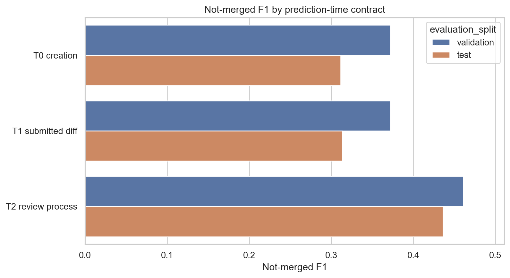

# Final Report: PR-Level Signals for GitHub Merge Outcomes

## Executive Answer

The project asks whether PR-level features can help explain and predict GitHub PR merge outcomes. The answer is yes, but the early-information answer is only **moderate predictive association**. The selected early model is **Random forest balanced**. On the untouched official test file, the default threshold reaches not-merged precision 0.225, recall 0.515, and F1 0.314. A validation-tuned threshold raises not-merged F1 to 0.326 while lowering recall.

The upgraded result is the prediction-time contract study: T0 PR-creation features reach test F1 0.311, T1 submitted-diff features reach 0.314, and T2 review-process features reach 0.436. This is **not causal** evidence and is **not suitable for automated merge decisions**. The result is useful for empirical understanding because it separates early PR context from information that becomes available only after review has started, under an explicit feature-availability contract and external-validity checks.

## Dataset and Prediction-Time Contracts

The analysis uses the Zenodo PRFeatures train/test files from "GitHub Pull Request Analysis: Sentiment Data and Developer Survey Responses." The target is `merged_or_not`. The comment dataset and survey file are documented but not used as the main modeling source because the PR-level files already match the research question and comment-derived fields create stronger timing risk.

The official train/test files are large and class-imbalanced: about 89% merged and 11% not merged. A majority baseline has high accuracy but zero utility for detecting not-merged PRs, so the report emphasizes not-merged precision, recall, F1, balanced accuracy, average precision, and ROC-AUC.

The headline model uses the `headline_leakage_safer_features` policy. Identifiers and direct post-outcome fields are excluded. Review discussion, sentiment, CI outcomes, success-rate fields, lifetime/close-time fields, and close-time PR evolution fields are held back from the early model. They appear only in a separate T2 review-process contract so the project does not pretend late review information was available at PR creation.

The separate comment dataset contains 588,097 parsed comment rows and 66,281 owner/repository/pull-number keys. It is profiled but not joined to PRFeatures because the PRFeatures files expose numeric ids, while the comment file exposes owner/repo/pull number. This avoids forcing a bad linkage.

| Feature               | Timing                           | Risk   | Role     |
| --------------------- | -------------------------------- | ------ | -------- |
| first_pr              | pre-pr contributor history       | low    | headline |
| core_member           | pre-pr contributor/project role  | low    | headline |
| prior_interaction     | historical interaction           | low    | headline |
| followers             | profile snapshot                 | low    | headline |
| prev_pullreqs         | pre-pr contributor history       | low    | headline |
| account_creation_days | pre-pr contributor history       | low    | headline |
| contrib_perc_commit   | historical contribution share    | medium | headline |
| sloc                  | submission-time project snapshot | low    | headline |
| team_size             | submission-time project snapshot | low    | headline |
| language              | project metadata                 | low    | headline |

Professor-facing safeguards:

| Risk | What the project does | Why this matters |
| ---- | --------------------- | ---------------- |
| Feature timing ambiguity | Uses a headline leakage-safer policy, an ultra-conservative sensitivity model, and a later T2 review-process contract. | A stronger score is not allowed to silently become the early-prediction answer. |
| Test-set overfitting | Selects model and threshold on internal validation, then reports the untouched official test once. | The final test result is evaluation evidence, not model-selection evidence. |
| Entity memorization | Excludes direct ids and reports project/creator overlap plus group-holdout diagnostics. | The official split is treated as familiar-ecosystem generalization, not unseen-project proof. |
| Overstated probabilities | Separates ranking/F1 results from calibration diagnostics. | Calibrated probabilities are discussed as probability quality, not as better classification performance. |
| Weak clustering | Frames K-means/PCA as profile interpretation only. | The unsupervised task supports characterization, not the main predictive claim. |

## Exploratory Data Analysis

EDA is not used to claim causality. It establishes why imbalance-aware metrics, contributor/project features, and group-aware validation are necessary.

| Finding                                                              | Evidence                                                                                           | Interpretation                                                                               |
| -------------------------------------------------------------------- | -------------------------------------------------------------------------------------------------- | -------------------------------------------------------------------------------------------- |
| Class imbalance drives metric choice                                 | Merged PRs: 932,538 (89.16%); not merged: 113,345 (10.84%).                                        | Accuracy-only evaluation would reward the majority class and hide not-merged failures.       |
| First-time contributors have visibly higher non-merge rates          | First PR not-merged rate 19.32% vs 10.55% for non-first PRs.                                       | Contributor history is a meaningful association, not a causal claim.                         |
| Core-member status separates outcomes                                | Non-core not-merged rate 17.44% vs 9.21% for core members.                                         | Role/context features help explain why contributor-history features matter.                  |
| Merged PRs come from contributors with deeper prior project history  | Median previous PRs: 22 for not-merged vs 41 for merged; median contribution share 0.028 vs 0.099. | The model's reliance on contributor-history signals is consistent with EDA.                  |
| Non-merged PRs are associated with larger or busier project contexts | Median open PRs: 22 for not-merged vs 12 for merged; median stars 289 vs 130.                      | Project context is predictive, but it also raises external-validity and clustering concerns. |
| CI presence is associated with a lower non-merge rate                | CI-present not-merged rate 9.91% vs 12.95% when no CI is recorded.                                 | CI is treated as context only; CI outcome fields remain excluded from the headline model.    |
| Rows are concentrated in recurring projects and creators             | Top 500 projects contain 52.03% of train rows; top 500 creators contain 21.65%.                    | This supports project/creator overlap checks and stricter group-holdout stress tests.        |
| Language-code groups differ, but labels are encoded                  | Highest not-merged language code 1: 13.97%; lowest code 0: 9.30%.                                  | Language is useful as nominal project metadata, not as an ordinal numeric scale.             |

## Supervised Study

Models compared on internal validation include a dummy majority classifier, balanced logistic regression, balanced decision tree, balanced random forest, and weighted histogram gradient boosting. The primary selection metric is not-merged F1 because not-merged PRs are the minority class.

| Model                           | Bal. acc. | P0    | R0    | F1-0  | AP-0  |
| ------------------------------- | --------- | ----- | ----- | ----- | ----- |
| Random forest balanced          | 0.702     | 0.269 | 0.602 | 0.372 | 0.388 |
| Hist gradient boosting weighted | 0.690     | 0.228 | 0.644 | 0.337 | 0.358 |
| Decision tree balanced          | 0.651     | 0.202 | 0.580 | 0.300 | 0.308 |
| Logistic regression balanced    | 0.610     | 0.162 | 0.595 | 0.254 | 0.205 |
| Dummy majority                  | 0.500     | 0.000 | 0.000 | 0.000 | 0.108 |

Final official test metrics:

| Threshold | Acc.  | Bal. acc. | P0    | R0    | F1-0  | AP-0  |
| --------- | ----- | --------- | ----- | ----- | ----- | ----- |
| Default   | 0.756 | 0.650     | 0.225 | 0.515 | 0.314 | 0.301 |
| Tuned F1  | 0.838 | 0.629     | 0.296 | 0.364 | 0.326 | 0.301 |

The validation-only tuned threshold is stable enough to report separately: across six sampled folds, the median selected threshold is 0.548, with range 0.542 to 0.564. The tuned fold mean not-merged F1 is 0.351.

## Prediction-Time Contract Study

The central upgrade is that the project no longer treats all predictors as one flat feature set. It asks when each signal becomes available. T0 is the PR-creation model, T1 is the submitted-diff model, and T2 is the review-process model. T2 is allowed to use discussion, sentiment, CI-progress, and reviewer/integrator context, so a stronger T2 score is interpreted as later decision-process signal rather than a deployable early predictor.

| Contract          | Split      | Features | P0    | R0    | F1-0  | AP-0  |
| ----------------- | ---------- | -------- | ----- | ----- | ----- | ----- |
| T0 creation       | validation | 22       | 0.268 | 0.609 | 0.372 | 0.390 |
| T0 creation       | test       | 22       | 0.223 | 0.517 | 0.311 | 0.302 |
| T1 submitted diff | validation | 25       | 0.269 | 0.602 | 0.372 | 0.388 |
| T1 submitted diff | test       | 25       | 0.225 | 0.515 | 0.314 | 0.301 |
| T2 review process | validation | 58       | 0.331 | 0.761 | 0.461 | 0.532 |
| T2 review process | test       | 58       | 0.315 | 0.708 | 0.436 | 0.479 |

The contract comparison improves the answer: early PR-level context is already predictive, submitted-diff features add little beyond that, and review-process fields add a much larger signal. This pattern makes the result less forced because it explains why stronger metrics require later information.

Paired model-delta bootstrap:

| Comparison                      | Metric                       | Delta | CI low | CI high |
| ------------------------------- | ---------------------------- | ----- | ------ | ------- |
| Hist gradient boosting weighted | f1_not_merged                | 0.035 | 0.033  | 0.037   |
| Hist gradient boosting weighted | average_precision_not_merged | 0.029 | 0.027  | 0.031   |

## Risk Ranking, Calibration, and Error Analysis

The final model is more useful as a ranking signal than as a hard decision engine. The highest predicted-risk decile has an observed not-merged rate of 33.28%, compared with the test baseline of 10.81% and 2.72% in the lowest-risk decile. This lift supports the claim that the model captures signal even though the tuned F1 remains moderate.

Calibration is imperfect: the weighted mean absolute calibration error is 0.308 and the not-merged Brier score is 0.187. Therefore predicted scores should be treated as relative risk scores, not literal probabilities.

Calibrating a held-out validation slice materially improves probability honesty. The best calibration method by Brier score is `isotonic` with Brier 0.086 and weighted absolute calibration error 0.005. This does not replace the F1-based classifier, and the calibrated default-threshold F1 is lower because calibrated minority-class probabilities are conservative under the 11% base rate. The calibration result fixes a narrower weakness: raw Random Forest scores should not be read as literal probabilities.

| Method       | Brier | Cal. error | AP-0  | F1-0  |
| ------------ | ----- | ---------- | ----- | ----- |
| uncalibrated | 0.175 | 0.292      | 0.326 | 0.345 |
| sigmoid      | 0.086 | 0.004      | 0.326 | 0.123 |
| isotonic     | 0.086 | 0.005      | 0.314 | 0.136 |

Tuned-threshold error profiles show what the model gets wrong:

| Outcome group      | Rows    | Test % | Mean P0 score | Median open PRs | Median stars | Median added lines |
| ------------------ | ------- | ------ | ------------- | --------------- | ------------ | ------------------ |
| Correct Not Merged | 10,234  | 3.933  | 0.728         | 39.000          | 761.500      | 27.000             |
| Missed Not Merged  | 17,888  | 6.875  | 0.418         | 13.000          | 125          | 19.000             |
| False Not Merged   | 24,393  | 9.375  | 0.664         | 35.000          | 608          | 21.000             |
| Correct Merged     | 207,680 | 79.817 | 0.371         | 10.000          | 92.000       | 15.000             |

- **Predicted risk ranks concentrate not-merged outcomes.** Top risk decile actual not-merged rate 33.28% vs baseline 10.81% and lowest decile 2.72%. The model is more defensible as a risk-ranking signal than as a precise decision rule.
- **Missed not-merged PRs receive lower risk scores than caught not-merged PRs.** Mean not-merged score 0.418 for missed not-merged PRs vs 0.728 for correctly flagged not-merged PRs. The main failure mode is ambiguous not-merged cases that look similar to merged PRs under available features.
- **False not-merged predictions are concentrated in busier or larger project contexts.** False not-merged median open PRs 35 and stars 608 vs correct-merged medians 10 and 92. Project context is useful but can make accepted PRs in large/busy repositories look risky.
- **Scores are imperfectly calibrated.** Weighted mean absolute calibration error 0.308; Brier score for not-merged score 0.187. Predicted scores should be treated as ranking evidence, not literal probabilities.

## Generalization and Robustness

The official test split is useful, but it is not an unseen-project split. Many test projects and creators also appear in the training file. This means the official holdout mostly tests new PRs in familiar ecosystems, not generalization to entirely unseen projects.

Exact PR-id integrity is clean: train/test PR id overlap is 0, and duplicate ids are zero in both official files. The remaining split concern is entity reuse, not duplicate PR leakage.

| Entity     | Train unique | Test unique | Seen test rows % |
| ---------- | ------------ | ----------- | ---------------- |
| project_id | 8,562        | 5,837       | 97.852           |
| creator_id | 44,012       | 17,669      | 84.090           |

Additional sampled stress tests use random, temporal, project-group, and creator-group validation. The weakest stress case is Project holdout with not-merged F1 0.249.

| Stress test      | Bal. acc. | P0    | R0    | F1-0  | ROC   |
| ---------------- | --------- | ----- | ----- | ----- | ----- |
| Random sample    | 0.684     | 0.258 | 0.566 | 0.354 | 0.756 |
| Temporal holdout | 0.610     | 0.196 | 0.342 | 0.250 | 0.679 |
| Project holdout  | 0.593     | 0.185 | 0.381 | 0.249 | 0.651 |
| Creator holdout  | 0.641     | 0.227 | 0.479 | 0.308 | 0.700 |

A separate model-family stress comparison supports the Random Forest choice, but not as an absolute winner in every stricter split. Random Forest leads the random, temporal, and creator-group diagnostics; histogram gradient boosting narrowly leads the project-group holdout. The submitted model remains Random Forest because the model-selection rule was declared on not-merged F1 before test scoring and because its stress behavior is competitive without changing the feature contract.

| Stress test      | Best F1 model                   | Bal. acc. | F1-0  | AP-0  |
| ---------------- | ------------------------------- | --------- | ----- | ----- |
| Random sample    | Random forest balanced          | 0.678     | 0.351 | 0.334 |
| Temporal holdout | Random forest balanced          | 0.612     | 0.254 | 0.200 |
| Project holdout  | Hist gradient boosting weighted | 0.644     | 0.297 | 0.229 |
| Creator holdout  | Random forest balanced          | 0.656     | 0.327 | 0.323 |

The validation-to-test gap is reported directly:

| Split               | Threshold | Bal. acc. | F1-0  | AP-0  |
| ------------------- | --------- | --------- | ----- | ----- |
| Internal validation | Default   | 0.702     | 0.372 | 0.388 |
| Internal validation | Tuned F1  | 0.679     | 0.405 | 0.388 |
| Official test       | Default   | 0.650     | 0.314 | 0.301 |
| Official test       | Tuned F1  | 0.629     | 0.326 | 0.301 |

The larger generalization benchmark repeats the concern with a 500k-row holdout design for temporal, project-group, and creator-group splits. These rows are not intended to exactly match the sampled stress-test values above: the samples, validation rates, and group partitions differ. The consistent conclusion is the important one: the official split is useful, but external-validity is weaker under stricter time/entity holdouts.

| Benchmark       | Train rows | Eval rows | P0    | R0    | F1-0  | AP-0  |
| --------------- | ---------- | --------- | ----- | ----- | ----- | ----- |
| Official test   | 1,045,883  | 260,195   | 0.225 | 0.515 | 0.314 | 0.301 |
| Temporal        | 375,000    | 125,000   | 0.191 | 0.344 | 0.246 | 0.197 |
| Project holdout | 372,830    | 127,170   | 0.226 | 0.504 | 0.312 | 0.249 |
| Creator holdout | 375,150    | 124,850   | 0.231 | 0.482 | 0.312 | 0.276 |

## Explanation Evidence

Random Forest impurity importance is reported, but the stronger explanation checks are permutation importance and feature-family ablation. These do not prove causality; they show which feature groups the model relies on for predictive performance.

| Feature               | Mean F1 drop | Std.  |
| --------------------- | ------------ | ----- |
| open_pr_num           | 0.025        | 0.002 |
| fork_num              | 0.020        | 0.001 |
| open_issue_num        | 0.016        | 0.002 |
| account_creation_days | 0.016        | 0.001 |
| followers             | 0.014        | 0.001 |
| project_age           | 0.012        | 0.002 |
| sloc                  | 0.012        | 0.001 |
| test_lines_per_kloc   | 0.012        | 0.001 |
| ci_exists             | 0.012        | 0.001 |
| contrib_perc_commit   | 0.011        | 0.004 |

Feature-family ablation:

| Removed             | F1-0  | Delta F1 | AP-0  |
| ------------------- | ----- | -------- | ----- |
| None                | 0.354 | 0.000    | 0.342 |
| Contributor history | 0.335 | -0.019   | 0.323 |
| Project context     | 0.324 | -0.030   | 0.302 |
| PR scope            | 0.354 | -0.001   | 0.349 |
| Testing/CI          | 0.342 | -0.012   | 0.329 |
| Language/calendar   | 0.354 | -0.000   | 0.340 |

## Sensitivity and Unsupervised Profiles

Feature-policy sensitivity shows that the stricter headline result is lower than the integrator-assumed result, which is exactly why `prior_review_num` should remain outside the headline model. K-means/PCA is used only for unsupervised PR-profile interpretation. The highest not-merged cluster is cluster 1 with a not-merged rate of 0.206 and label `higher not-merged / smaller-change / larger-project`.

| Policy     | Split      | P0    | R0    | F1-0  | AP-0  |
| ---------- | ---------- | ----- | ----- | ----- | ----- |
| Strict     | Validation | 0.213 | 0.568 | 0.310 | 0.276 |
| Headline   | Validation | 0.269 | 0.602 | 0.372 | 0.388 |
| Integrator | Validation | 0.328 | 0.599 | 0.424 | 0.449 |
| Timing     | Validation | 0.273 | 0.599 | 0.375 | 0.393 |
| Strict     | Test       | 0.188 | 0.501 | 0.273 | 0.222 |
| Headline   | Test       | 0.225 | 0.515 | 0.314 | 0.301 |
| Integrator | Test       | 0.290 | 0.521 | 0.373 | 0.382 |
| Timing     | Test       | 0.227 | 0.515 | 0.315 | 0.303 |

## Appendix Evidence Map

| Requirement                     | Weight          | Primary evidence                                                                                                                                                                                                                                                                                                                   |
| ------------------------------- | --------------- | ---------------------------------------------------------------------------------------------------------------------------------------------------------------------------------------------------------------------------------------------------------------------------------------------------------------------------------- |
| problem description and clarity | 10%             | README.md; final_report.pdf; final_presentation.pdf                                                                                                                                                                                                                                                                                |
| exploratory data analysis       | 20%             | eda_key_findings.csv; target_distribution_summary.csv; eda_safe_feature_patterns.png                                                                                                                                                                                                                                               |
| empirical data analysis study   | 20%             | model_comparison.csv; final_test_metrics.csv; prediction_contract_comparison.csv; calibration_model_comparison.csv; full_generalization_benchmarks.csv; paired_model_delta_intervals.csv; test_prediction_risk_bands.csv; calibration_summary.csv; error_profile_summary.csv; threshold_stability.csv; stress_model_comparison.csv |
| algorithm comprehension         | 10%             | algorithm_comprehension.csv                                                                                                                                                                                                                                                                                                        |
| data characteristics            | assignment note | data_quality_summary.csv; feature_timing_evidence.csv; prediction_contract_feature_map.csv; review_process_feature_audit.csv; comment_dataset_profile.csv; split_id_integrity.csv; split_overlap_summary.csv                                                                                                                       |
| main findings and conclusions   | 10%             | final_report.pdf; final_presentation.pdf; error_analysis_key_findings.csv; self_review.md                                                                                                                                                                                                                                          |
| notebook/code organization      | 10%             | scripts/build_analysis_notebooks.py; scripts/build_final_report.py; scripts/validate_final_outputs.py                                                                                                                                                                                                                              |
| slides and discussion support   | 20%             | slides/final_presentation.md; slides/final_presentation.pdf                                                                                                                                                                                                                                                                        |

## Threats to Validity

The main threat is feature timing: some project/context fields are treated as submission-time snapshots because the source field documentation supports that interpretation, but inherited preprocessing choices cannot be fully audited from the provided CSVs. The official test split has strong project and creator overlap with training. Bootstrap intervals quantify sampling uncertainty but not feature-timing bias, model-selection uncertainty, or external-validity limits. The conclusions are therefore empirical and associational, not causal or operational.

## References

- Zenodo dataset: https://zenodo.org/records/10049493
- new_pullreq field README: https://www.gitlink.org.cn/Raining/new_pullreq_dataset
- MSR 2020 dataset paper: https://yuyue.github.io/res/paper/newPR_MSR2020.pdf
- Zhang et al. PR decisions paper: https://zhangxunhui.github.io/files/TSE_2022_zxh.pdf
