

# Can PR-Level Features Explain and Predict GitHub PR Merge Outcomes?

**Answer:** yes, but only as **moderate predictive association**.

- Headline model: **Random forest balanced**
- Feature contract: **25 leakage-safer PR-level features**
- Official test not-merged F1: **0.314** default, **0.326** validation-tuned
- Review-process contract F1: **0.436**, showing later process signal
- Claim boundary: **not causal**, **not deployment-ready**, weaker under stricter generalization

---

## Research Design

| Decision | Final choice |
|---|---|
| Question | Can PR-level features explain and predict merge outcomes? |
| Target | `merged_or_not` |
| Main data | PRFeatures train/test files |
| Headline claim | Early/submission-time feature association |
| Main risk | Feature timing and project/creator overlap |

The project is framed as an empirical data-analysis study, not a merge-decision product.

---

## Dataset and Scope

Source: Zenodo PRFeatures dataset from *GitHub Pull Request Analysis: Sentiment Data and Developer Survey Responses*.

| File | Role | Rows | Columns |
|---|---|---:|---:|
| `prfeatures_train_data.csv` | model development / final training | 1,045,883 | 72 |
| `prfeatures_test_data.csv` | untouched official test | 260,195 | 72 |
| `pr_comments_dataset_publish.csv` | profiled, not joined | 588,097 | 15 |
| `survey_responses_raw.csv` | documented, not main model source | 22 | 56 |

The comment file lacks the numeric PRFeatures join keys, so it is profiled rather than force-joined.

---

## Target and Data Characteristics

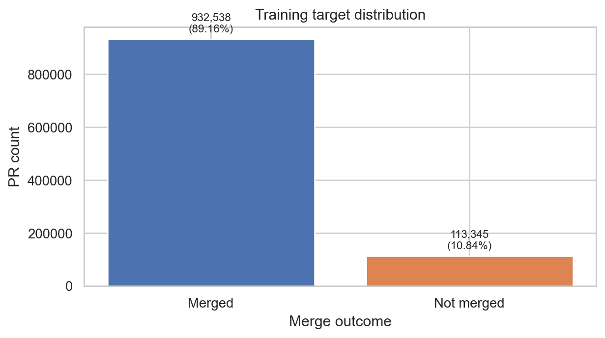

| Split | Merged | Not merged |
|---|---:|---:|
| Train | 932,538 (89.16%) | 113,345 (10.84%) |
| Test | 232,073 (89.19%) | 28,122 (10.81%) |

Accuracy alone is misleading: a majority baseline has 89% accuracy and 0 not-merged recall.

---

## Feature-Availability Contract

| Feature group | Treatment | Reason |
|---|---|---|
| Direct identifiers | Excluded | identity can memorize ecosystems |
| Post-outcome fields | Excluded | close-time and lifetime variables leak outcome process |
| Comments/sentiment/CI outcomes | Excluded | can encode review process after submission |
| `prior_review_num` | Sensitivity only | reviewer/integrator-context assumption |
| Headline features | Used | contributor history, project context, PR scope, testing context |

This is a defensible early-information model, not the highest possible metric model.

---

## Professor Defense Spine

| Likely challenge | Answer we defend |
|---|---|
| Are you forcing a result? | No. The headline result is moderate, and stronger T2 results are labeled later-stage. |
| Is there leakage? | Direct ids, post-outcome fields, comments, CI outcomes, and risky success-rate fields are excluded or sensitivity-only. |
| Does the math make sense? | Metrics are confusion-matrix based, validation-selected, and checked against the untouched official test. |
| Does it generalize? | Partially. Official PR ids are clean, but project/creator overlap limits external validity. |
| What is the answer? | PR-level signal exists, but prediction strength depends on feature availability. |

This is the line to hold in Q&A.

---

## EDA Findings

| Finding | Evidence |
|---|---|
| First PRs are riskier | 19.32% not merged vs 10.55% for non-first PRs |
| Core members differ | 9.21% not merged vs 17.44% for non-core contributors |
| Prior project history matters | median previous PRs: 22 not-merged vs 41 merged |
| Project concentration is high | top 500 projects contain 52.03% of training rows |
| CI presence differs | 9.91% not merged with CI vs 12.95% without CI |

These are associations in observational data, not causal effects.

---

## EDA Evidence

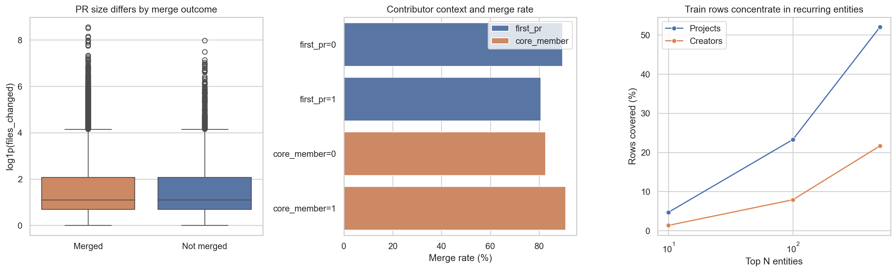

EDA supports the modeling story: class imbalance, contributor context, project scale, and repeated entities all matter.

---

## Model Design and Algorithm Comprehension

| Method | Why used | Limitation |
|---|---|---|
| Dummy majority | exposes class-imbalance trap | detects no not-merged PRs |
| Logistic regression | interpretable weighted linear baseline | weak on interactions |
| Decision tree | simple non-linear rules | unstable if unconstrained |
| Random forest | averages balanced trees | importance is not causal |
| Histogram gradient boosting | boosted supervised comparator | close, but lower primary F1 |
| K-means + PCA | unsupervised profile analysis | interpretive, not predictive |

Selection rule: maximize **not-merged F1** on internal validation, then retrain once on all training rows.

---

## Validation Comparison

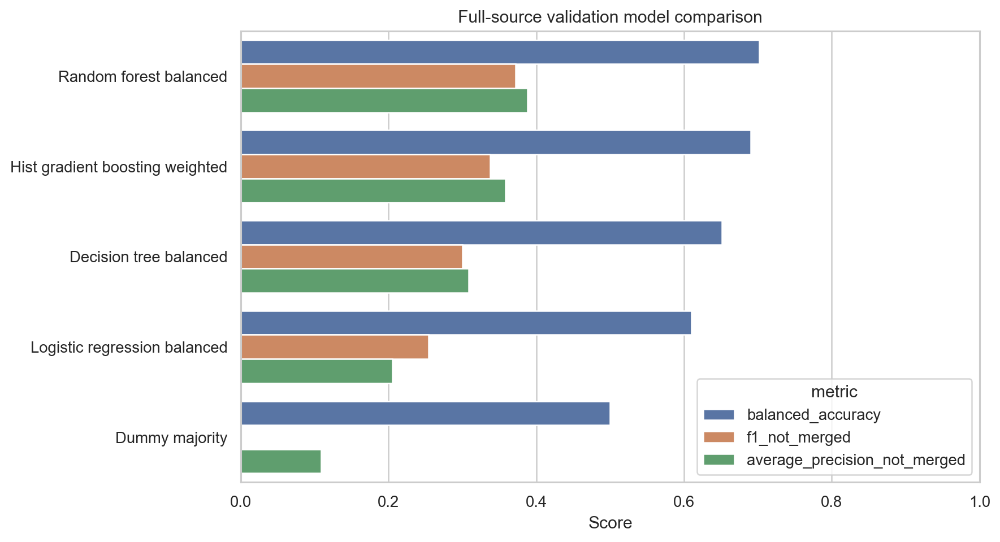

| Model | Balanced acc. | Not-merged recall | Not-merged F1 | ROC-AUC |
|---|---:|---:|---:|---:|
| Random forest balanced | 0.702 | 0.602 | 0.372 | 0.778 |
| Histogram gradient boosting | 0.690 | 0.644 | 0.337 | 0.759 |
| Logistic regression balanced | 0.610 | 0.595 | 0.254 | 0.655 |
| Dummy majority | 0.500 | 0.000 | 0.000 | 0.500 |

---

## Threshold Tuning and Final Test

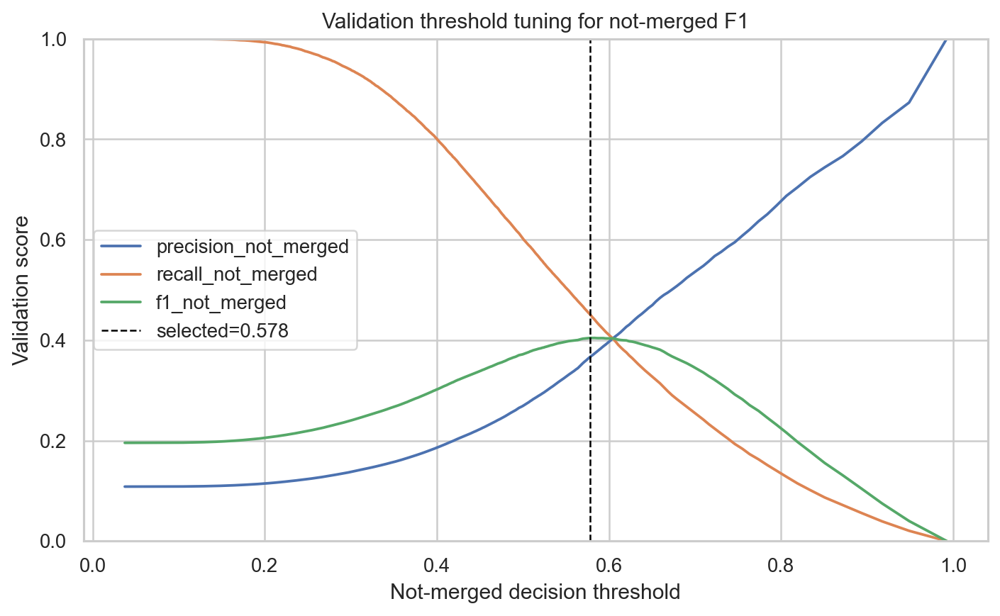

| Metric | Default | Tuned |
|---|---:|---:|
| Accuracy | 0.756 | 0.838 |
| Balanced acc. | 0.650 | 0.629 |
| Precision, not merged | 0.225 | 0.296 |
| Recall, not merged | 0.515 | 0.364 |
| F1, not merged | 0.314 | 0.326 |
| Avg precision, not merged | 0.301 | 0.301 |

Tuned threshold: `0.578`, selected on validation predictions only.

---

## Final Confusion Matrix

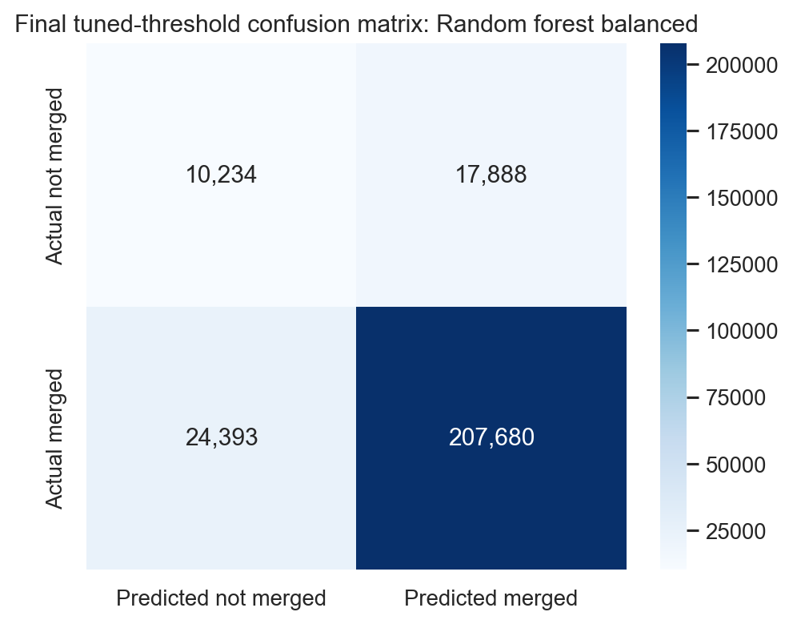

Tuned-threshold counts:

| Correct not merged | Missed not merged | False not merged | Correct merged |
|---:|---:|---:|---:|
| 10,234 | 17,888 | 24,393 | 207,680 |

The model finds signal, but it is not reliable enough for automated decisions.

---

## Prediction-Time Contracts

| Contract | What is allowed | Test F1 | Test AP |
|---|---|---:|---:|
| T0 creation | history, project snapshots, description | 0.311 | 0.302 |
| T1 submitted diff | T0 + initial diff/test inclusion | 0.314 | 0.301 |
| T2 review process | T1 + comments, CI progress, integrator context | 0.436 | 0.479 |

This is the upgraded answer: stronger metrics require later review-process information.

The early model is still moderate; the late model shows where extra signal enters.

---

## Risk Ranking, Not Certainty

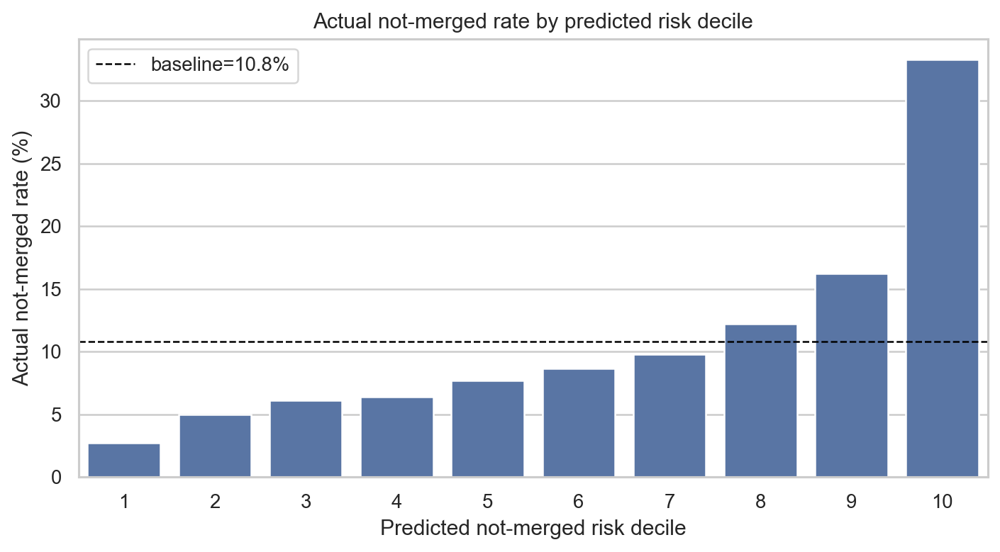

- The score is most defensible as **relative risk**, not a literal probability.
- High predicted-risk bands should contain more not-merged PRs than the baseline.
- Calibration is checked separately so the project does not overclaim probability quality.

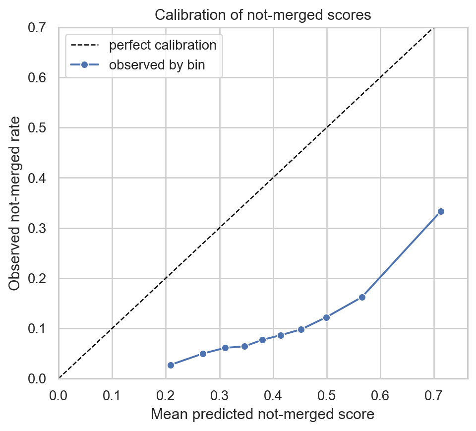

Professor-facing claim: the model can rank risk better than chance, but it cannot make reliable merge decisions.

---

## Calibration Upgrade

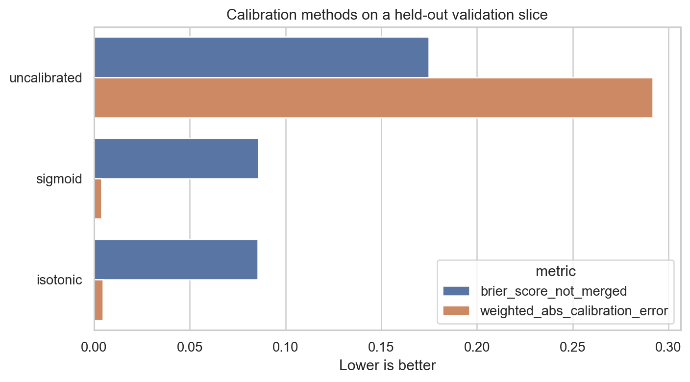

| Method | Brier | Cal. error | AP | F1 |
|---|---:|---:|---:|---:|
| Uncalibrated | 0.175 | 0.292 | 0.326 | 0.345 |
| Sigmoid | 0.086 | 0.004 | 0.326 | 0.123 |
| Isotonic | 0.086 | 0.005 | 0.314 | 0.136 |

Calibration fixes probability honesty. It does not optimize F1, and calibrated default-threshold F1 drops because the not-merged base rate is only about 11%.

---

## Where the Model Fails

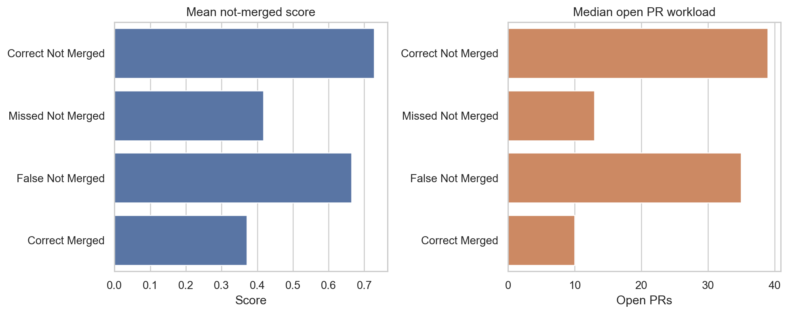

- **Missed not-merged PRs:** not-merged cases that look too similar to merged PRs under the available features.
- **False not-merged predictions:** accepted PRs in contexts that look risky, especially busier/larger repositories.
- This is why the final answer stays bounded to **moderate association**.

Error analysis strengthens the conclusion because it explains failure modes instead of hiding them.

---

## Split Overlap and Validation-Test Gap

| Entity | Test unique overlap | Test rows with seen entity |
|---|---:|---:|
| PR id | 0.00% | 0.00% |
| Project | 94.91% | 97.85% |
| Creator | 69.39% | 84.09% |

| Evaluation | Threshold | Not-merged F1 | Average precision |
|---|---|---:|---:|
| Validation | default | 0.372 | 0.388 |
| Validation | tuned | 0.405 | 0.388 |
| Official test | default | 0.314 | 0.301 |
| Official test | tuned | 0.326 | 0.301 |

The official holdout has clean PR ids, but it is not an unseen-project or unseen-creator test.

---

## Generalization Stress Tests

Sampled stress tests, each using the same headline feature policy:

| Stress test | Balanced acc. | Precision | Recall | F1 |
|---|---:|---:|---:|---:|
| Random stratified | 0.684 | 0.258 | 0.566 | 0.354 |
| Temporal last 25% | 0.610 | 0.196 | 0.342 | 0.250 |
| Project-group holdout | 0.593 | 0.185 | 0.381 | 0.249 |
| Creator-group holdout | 0.641 | 0.227 | 0.479 | 0.308 |

Stress tests are the external-validity reality check: the signal weakens for later or unseen-project-like validation.

---

## Larger Generalization Benchmarks

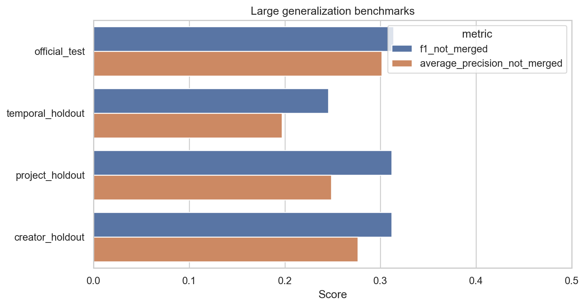

| Benchmark | Train rows | Eval rows | F1 | AP |
|---|---:|---:|---:|---:|
| Official test | 1,045,883 | 260,195 | 0.314 | 0.301 |
| Temporal holdout | 375,000 | 125,000 | 0.246 | 0.197 |
| Project holdout | 372,830 | 127,170 | 0.312 | 0.249 |
| Creator holdout | 375,150 | 124,850 | 0.312 | 0.276 |

The sampled and larger holdouts are different diagnostics, so the exact values need not match.

The shared conclusion is stable: the official split is useful, but stricter holdouts change the story.

---

## Threshold and Model Robustness

What this slide defends:

| Concern | Evidence |
|---|---|
| One lucky threshold | repeated sampled folds select thresholds from 0.542 to 0.564 |
| One lucky model split | model families are compared under random, temporal, project, and creator splits |
| Random Forest vs HGB | paired validation delta: +0.035 F1, 95% CI +0.033 to +0.037 |
| Absolute winner claim | not made; HGB narrowly leads the project-group diagnostic |

The submitted model remains Random Forest because the selection rule was declared before test scoring.

---

## Uncertainty: Row vs Project-Cluster Bootstrap

Tuned-threshold 95% intervals:

| Metric | Estimate | Row bootstrap | Project-cluster bootstrap |
|---|---:|---:|---:|
| Precision, not merged | 0.296 | 0.290 to 0.300 | 0.265 to 0.327 |
| Recall, not merged | 0.364 | 0.358 to 0.370 | 0.323 to 0.408 |
| F1, not merged | 0.326 | 0.321 to 0.331 | 0.296 to 0.360 |
| Balanced accuracy | 0.629 | 0.626 to 0.632 | 0.611 to 0.650 |

Project-cluster intervals are wider because PRs are correlated within repositories.

---

## Feature-Policy Sensitivity

| Feature policy | Validation F1 | Test F1 | Interpretation |
|---|---:|---:|---|
| Ultra-conservative | 0.310 | 0.273 | strictest feature contract |
| Headline leakage-safer | 0.372 | 0.314 | submitted result |
| Integrator-assumed | 0.424 | 0.373 | stronger timing assumption |
| Extended timing-assumed | 0.375 | 0.315 | little gain over headline |

The strongest-looking feature policy is not the headline model because it depends on stronger availability assumptions.

---

## Explanation Evidence

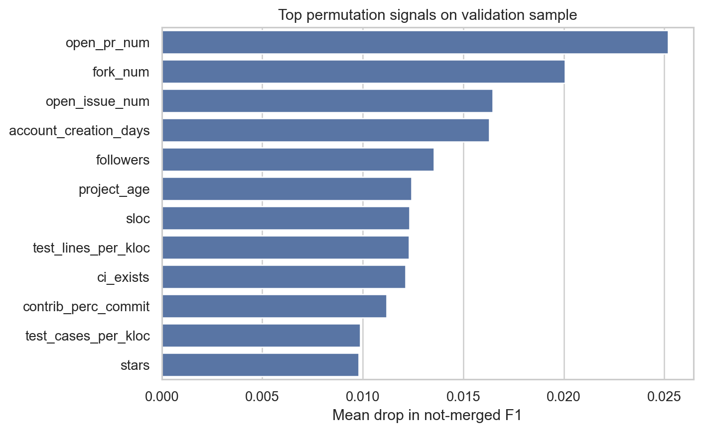

Top permutation signals:

- `open_pr_num`
- `fork_num`
- `open_issue_num`
- `account_creation_days`
- `followers`
- `project_age`
- `sloc`
- `test_lines_per_kloc`
- `ci_exists`
- `contrib_perc_commit`

Permutation importance and ablation are explanation diagnostics, not causal evidence.

---

## Feature-Family Ablation

Validation sample ablation against the full headline feature policy:

| Removed family | Not-merged F1 | Delta F1 | Avg precision delta |
|---|---:|---:|---:|
| None | 0.354 | 0.000 | 0.000 |
| Contributor history | 0.335 | -0.019 | -0.020 |
| Project context | 0.324 | -0.030 | -0.040 |
| PR scope | 0.354 | -0.001 | +0.007 |
| Testing/CI context | 0.342 | -0.012 | -0.014 |
| Language/calendar | 0.354 | 0.000 | -0.003 |

Project context and contributor history are the most important feature families in this diagnostic.

---

## Unsupervised PR Profiles

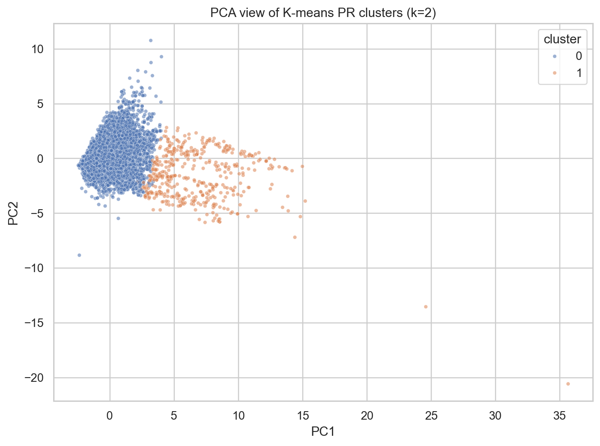

| Cluster | Size | Merge rate | Not-merged rate | Profile |
|---|---:|---:|---:|---|
| 0 | 67,183 | 89.57% | 10.43% | lower not-merged / larger-change / smaller-project |
| 1 | 2,817 | 79.45% | 20.55% | higher not-merged / smaller-change / larger-project |

K-means/PCA is a profile analysis, not a second classifier.

---

## Assignment Coverage

| Criterion | Evidence |
|---|---|
| Problem clarity | question, target, scope, feature-availability contract |
| EDA | concrete findings, imbalance, concentration, class-conditioned patterns |
| Empirical study | contracts, baselines, final test, calibration, holdouts, paired deltas |
| Algorithm comprehension | role and limitation table for every method |
| Data characteristics | missingness, skew/outliers, leakage timing, split overlap, comment join limit |
| Findings/report/slides | final notebook, report PDF, generated metrics, discussion deck |

Full evidence map: `deliverables/final/assignment_coverage.csv`

---

## Threats to Validity

- Feature timing is the main risk; risky fields are excluded or sensitivity-only.
- The official split has heavy project and creator overlap.
- Review-process features improve metrics but are not early-prediction features.
- The comment dataset is profiled, not force-joined, because local join keys do not match.
- Random Forest explanations are predictive, not causal.
- The model is not ready for deployment or automated PR decisions.

Professor-facing bottom line: the analysis is stronger because it admits these limits directly.

---

## Final Answer

The project does answer the chosen question.

Signal depends on when prediction is made.

- Early T1 submitted-diff test F1: **0.314** default, **0.326** tuned.
- T2 review-process test F1: **0.436**, but it uses later information.
- Calibration can make probabilities honest; it does not make decisions reliable.
- Larger holdouts show the official split is not the whole generalization story.
- The right conclusion is empirical association, not causality or automation.

Q&A framing: stronger metrics come from later information, not from pretending the early model is better.
